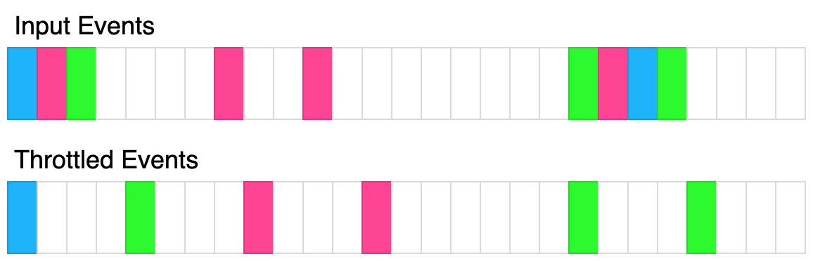

# 题目

## 节流

### 来源:

[力扣-节流](https://leetcode.cn/problems/throttle)

### 题目内容

现给定一个函数 `fn` 和一个以毫秒为单位的时间 `t` ，请你返回该函数的 **节流** 版本。

**节流** 函数首先立即被调用，然后在 `t` 毫秒的时间间隔内不能再次执行，但应该存储最新的函数参数，以便在延迟结束后使用这些参数调用 `fn` 。

例如，`t = 50ms` ，并且函数在 `30ms` 、 `40ms` 和 `60ms` 时被调用。第一次函数调用会在接下来的 `t`
毫秒内阻止调用函数。第二次函数调用会保存参数，而第三次调用的参数应该覆盖当前保存的第二次调用的参数，因为第二次和第三次调用发生在 `80ms`
之前。一旦延迟时间过去，节流函数应该使用延迟期间提供的最新参数进行调用，并且还应创建另一个延迟期间，时长为 `80ms + t` 。

上面的图示展示了节流如何转换事件。每个矩形代表100毫秒，节流时间为400毫秒。每种颜色代表不同的输入集合。

**示例 1：**

    
    
    **输入：** t = 100, calls = [{"t":20,"inputs":[1]}]
    **输出：** [{"t":20,"inputs":[1]}]
    **解释：** 第一次调用总是立即执行，没有延迟。
    

**示例 2：**

    
    
    **输入：** t = 50, calls = [{"t":50,"inputs":[1]},{"t":75,"inputs":[2]}]
    **输出：** [{"t":50,"inputs":[1]},{"t":100,"inputs":[2]}]
    **解释：**
    第一次调用立即执行带有参数 (1) 的函数。 
    第二次调用发生在 75毫秒 时，在延迟期间内，因为 50毫秒 + 50毫秒 = 100毫秒，所以下一次调用可以在 100毫秒 时执行。因此，我们保存第二次调用的参数，以便在第一次调用的回调函数中使用。
    

**示例 3：**

    
    
    **输入：** t = 70, calls = [{"t":50,"inputs":[1]},{"t":75,"inputs":[2]},{"t":90,"inputs":[8]},{"t": 140, "inputs":[5,7]},{"t": 300, "inputs": [9,4]}]
    **输出：** [{"t":50,"inputs":[1]},{"t":120,"inputs":[8]},{"t":190,"inputs":[5,7]},{"t":300,"inputs":[9,4]}]
    **解释：**
    第一次调用立即执行带有参数 (1) 的函数。 
    第二次调用发生在 75毫秒 时，在延迟期间内，因为 50毫秒 + 70毫秒 = 120毫秒，所以它只应保存参数。 
    第三次调用也在延迟期间内，因为我们只需要最新的函数参数，所以覆盖之前的参数。延迟期过后，在 120毫秒时进行回调，并使用保存的参数进行调用。该回调会创建另一个延迟期间，时长为 120毫秒 + 70毫秒 = 190毫秒，以便下一个函数可以在 190毫秒时调用。 
    第四次调用发生在 140毫秒，在延迟期间内，因此应在190毫秒时作为回调进行调用。这将创建另一个延迟期间，时长为 190毫秒 + 70毫秒 = 260毫秒。 
    第五次调用发生在 300毫秒，但它是在 260毫秒 之后，所以应立即调用，并创建另一个延迟期间，时长为 300毫秒 + 70毫秒 = 370毫秒。

**提示：**

  * `0 <= t <= 1000`
  * `1 <= calls.length <= 10`
  * `0 <= calls[i].t <= 1000`
  * `0 <= calls[i].inputs[i], calls[i].inputs.length <= 10`

