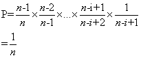

# 洗牌算法/打乱数组

由抽牌、换牌和插牌衍生出三种洗牌算法，其中抽牌和换牌分别对应 `Fisher-Yates Shuffle` 和 `Knuth-Durstenfeld Shhuffle` 算法。

## Fisher-Yates Shuffle 算法

> 最早提出这个洗牌方法的是 Ronald A. Fisher 和 Frank Yates，即 Fisher–Yates Shuffle，其基本思想就是从原始数组中随机取一个之前没取过的数字到新的数组中

### 步骤

1. 初始化原始数组和新数组，原始数组长度为 n(已知)；
2. 从还没处理的数组（假如还剩 k 个）中，随机产生一个[0, k)之间的数字 p（假设数组从 0 开始）；
3. 从剩下的 k 个数中把第 p 个数取出；
4. 重复步骤 2 和 3 直到数字全部取完；
5. 从步骤 3 取出的数字序列便是一个打乱了的数列。

> 下面证明其随机性，即每个元素被放置在新数组中的第 i 个位置是 1/n（假设数组大小是 n）。
证明：一个元素m被放入第i个位置的概率P = 前i-1个位置选择元素时没有选中m的概率 * 第i个位置选中m的概率，即<br>



```py
import random
def fisher_yates_shuffle(arr: list) -> list:
    leng = len(arr)
    res = []
    for i in range(leng):
        k = random.randint(len(arr))
        res.append(arr[k])
        arr.pop(k)
    return res
```

时间复杂度为 O(n\*n),空间复杂度为 O(n).

## Knuth-Durstenfeld Shuffle

> Knuth 和  Durstenfeld   在 Fisher 等人的基础上对算法进行了改进，在原始数组上对数字进行交互，省去了额外 O(n)的空间。该算法的基本思想和 Fisher 类似，每次从未处理的数据中随机取出一个数字，然后把该数字放在数组的尾部，即数组尾部存放的是已经处理过的数字。

### 算法步骤

1. 建立一个数组大小为 n 的数组 arr，分别存放 1 到 n 的数值；
2. 生成一个从 0 到 n - 1 的随机数 x；
3. 输出 arr 下标为 x 的数值，即为第一个随机数；
4. 将 arr 的尾元素和下标为 x 的元素互换；
5. 同 2，生成一个从 0 到 n - 2 的随机数 x；
6. 输出 arr 下标为 x 的数值，为第二个随机数；
7. 将 arr 的倒数第二个元素和下标为 x 的元素互换；<br>
   ……<br>
   如上，直到输出 m 个数为止

该算法是经典洗牌算法。它的 proof 如下：

> 对于 arr[i],洗牌后在第 n-1 个位置的概率是 1/n（第一次交换的随机数为 i）<br>
> 在 n-2 个位置概率是[(n-1)/n] _ [1/(n-1)] = 1/n，（第一次交换的随机数不为 i，第二次为 arr[i]所在的位置（注意，若 i=n-1，第一交换 arr[n-1]会被换到一个随机的位置））<br>
> 在第 n-k 个位置的概率是[(n-1)/n] _ [(n-2)/(n-1)] _..._ [(n-k+1)/(n-k+2)] \*[1/(n-k+1)] = 1/n<br>
> （第一个随机数不要为 i，第二次不为 arr[i]所在的位置(随着交换有可能会变)……第 n-k 次为 arr[i]所在的位置）.

```py
import random
def knuth_durstenfeld_shuffle(arr: list):
    for i in range(len(arr.size) - 1, -1, -1):
        tmp = random.randint(0, i)
        arr[tmp], arr[i] = arr[i], arr[tmp]

```
时间复杂度为O(n),空间复杂度为O(1)

原始数组被修改了，这是一个原地打乱顺序的算法，算法时间复杂度也从Fisher算法的 O(n^2)提升到了O(n)。

## Inside-Out Algorithm

>Knuth-Durstenfeld Shuffle 是一个内部打乱的算法，算法完成后原始数据被直接打乱，尽管这个方法可以节省空间，但在有些应用中可能需要保留原始数据，所以需要另外开辟一个数组来存储生成的新序列。<br>
Inside-Out Algorithm 算法的基本思思是从前向后扫描数据，把位置i的数据随机插入到前i个（包括第i个）位置中（假设为k），这个操作是在新数组中进行，然后把原始数据中位置k的数字替换新数组位置i的数字。其实效果相当于新数组中位置k和位置i的数字进行交互。

```py

import random

#直接修改原始数据
def shuffle(arr: list):
    leng = len(arr)
    for i in range(leng):
        ra = random.randint(0, i)
        arr[i], arr[ra] = arr[ra], arr[i]

# 开辟新空间
def shuffle2(arr: list) -> list:
    leng = len(arr)
    res = arr[:]
    for i in range(leng):
        ra = random.randint(0, i)
        res[i], res[ra] =res[ra], res[i]
    return res

```
