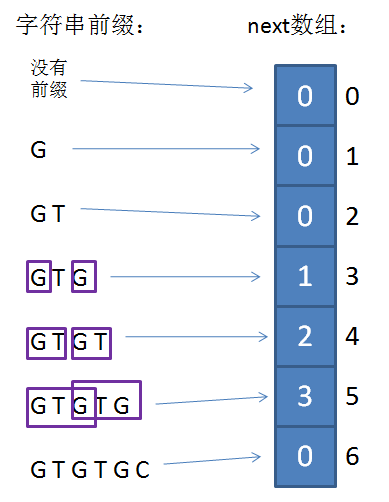

# KMP字符串匹配

KMP是三位大牛：D.E.Knuth（《计算机程序设计艺术》的作者）、J.H.Morris和V.R.Pratt同时发现的。
KMP算法要解决的问题就是在字符串（也叫主串）中的模式串（pattern）定位问题。模式串就是关键字（接下来称它为P），如果它在一个主串中出现，就返回它的具体位置，否则返回-1

## 思路(算法导论中和阮一峰提到的方法 即kmp2.py中的算法)

首先，对于这个问题有一个很朴素的想法：从左到右一个个匹配，如果这个过程中有某个字符不匹配，就跳回去，将模式串向右移动一位。 
这样做虽然可行，但是效率很差，因为要把 搜索位置 移到已经比较过的位置，重比一遍(这就是字符串匹配的BF算法，暴力搜索)。

一个基本事实是，当模式串与主串不匹配时，你其实知道前面已经相同的字符是什么了。 
KMP算法的想法是，设法利用这个已知信息，不要把 *搜索位置* 移回已经比较过的位置，继续把它向后移，这样就提高了效率

怎么做到这一点呢？可以针对搜索词，算出一张**部分匹配表**，使用部分匹配表结合搜索位置来得知移动模式串的位数。

公式： `移动位数 = 已匹配的字符数 - 最后一个匹配字符对应的部分匹配值`

### 部分匹配表(PMT)

下面介绍**部分匹配表**是如何产生的。

首先，要了解两个概念："前缀" 和 "后缀"。 "前缀" 指除了最后一个字符以外，一个字符串的全部头部组合；"后缀" 指除了第一个字符以外，一个字符串的全部尾部组合。

"部分匹配值" 就是 "前缀" 和 "后缀" 的最长的共有元素的长度。以 "ABCDABD" 为例，

> - "A"的前缀和后缀都为空集，共有元素的长度为0；
> - "AB"的前缀为[A]，后缀为[B]，共有元素的长度为0；
> - "ABC"的前缀为[A, AB]，后缀为[BC, C]，共有元素的长度0；
> - "ABCD"的前缀为[A, AB, ABC]，后缀为[BCD, CD, D]，共有元素的长度为0；
> - "ABCDA"的前缀为[A, AB, ABC, ABCD]，后缀为[BCDA, CDA, DA, A]，共有元素为"A"，长度为1；
> - "ABCDAB"的前缀为[A, AB, ABC, ABCD, ABCDA]，后缀为[BCDAB, CDAB, DAB, AB, B]，共有元素为"AB"，长度为2；
> - "ABCDABD"的前缀为[A, AB, ABC, ABCD, ABCDA, ABCDAB]，后缀为[BCDABD, CDABD, DABD, ABD, BD, D]，共有元素的长度为0。

## Next数组思路(参见kmp.py)

也有使用Next数组的算法，此算法(kmp.py)记录了下次模式串要比较的位置

这是一个一维整型数组，数组的下标代表了“已匹配前缀的下一个位置”，元素的值则是“最长可匹配前缀子串的下一个位置”。

当模式串的第一个字符就和主串不匹配时，并不存在已匹配前缀子串，更不存在最长可匹配前缀子串。这种情况对应的next数组下标是0，next[0]的元素值也是0。

next数组的生成使用了动态规划的思想